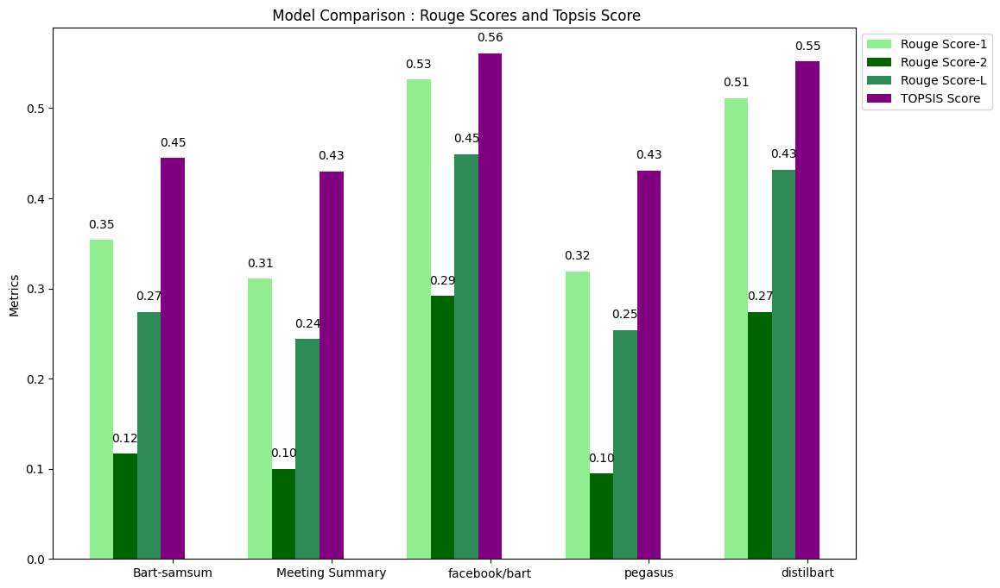
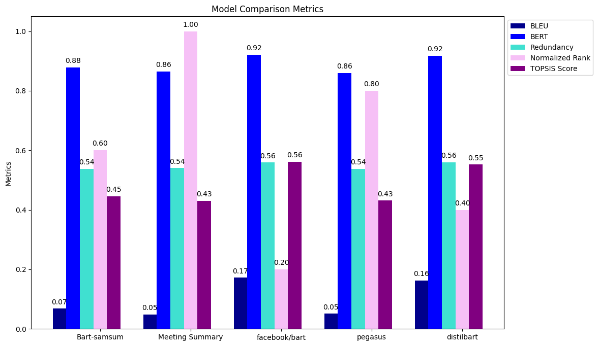

# Pretrained-Model-Comparison-using-Topsis

## Overview
Text summarization is a crucial natural language processing task that involves condensing large documents into concise and informative summaries. This project focuses on comparing the performance of various text summarization models to help users choose the most suitable model for their specific needs. 

## Model Metrics Evaluation
#### 1) BLEU Score (Bilingual Evaluation Understudy):
BLEU evaluates the quality of a generated summary by comparing it to one or more reference summaries. Precision is calculated based on the overlap of n-grams (sequences of n consecutive words) between the generated and reference summaries. BLEU scores range from 0 to 1, with 1 indicating a perfect match between the candidate and reference summaries.  

#### 2) BERT Score:
BERT Score is a valuable metric for evaluating text summarization and other text generation tasks. It measures token-level similarity between the model-generated summary and the reference summary by leveraging pre-trained BERT embeddings. BERTScore typically ranges between 0 and 1, with higher values indicating better agreement between the model-generated and reference summaries.  

#### 3) Rouge Scores (Recall-Oriented Understudy for Gisting Evaluation):
ROUGE is a set of metrics widely used for assessing automatic summarization tasks. It measures overlap between the model-generated and reference summaries in terms of n-grams. The main variants include ROUGE-1 (unigram overlap), ROUGE-2 (bigram overlap), and ROUGE-L (longest common subsequence). ROUGE scores vary between 0 and 1, with higher values indicating better overlap and similarity.  

#### 4) Redundancy Score:
The redundancy score quantifies the extent to which a summary unnecessarily repeats information from the original text or across multiple summaries. It is calculated as the ratio of unique words to the total number of words in the summaries. Lower redundancy scores suggest less repetition and higher efficiency in conveying information.  

## Methodology - TOPSIS
The Technique for Order of Preference by Similarity to Ideal Solution (TOPSIS) is a multi-criteria decision-making method commonly used for selecting the best alternative from a set of options. In the context of text summarization models, TOPSIS helps identify the most suitable pre-trained model based on various evaluation criteria.  

**1. Criteria Selection:** Define the criteria or metrics that are crucial for evaluating the performance of different alternatives. In text summarization, these criteria may include Rouge scores, BLEU score, BERTScore, or other relevant metrics.  

**2. Normalization:** Normalize the values of each criterion to ensure they are on a comparable scale. This step is essential for treating diverse metrics equally during the decision-making process.  

**3. Weight Assignment:** Assign weights to the normalized criteria based on their relative importance. This allows for emphasizing certain metrics over others, depending on their significance in the evaluation.  

**4. Ideal and Negative Ideal Solutions:** Identify the ideal solution (maximum values for each criterion) and the negative ideal solution (minimum values for each criterion) to represent the best and worst performance, respectively.  

**5. Similarity Calculation:** Calculate the distance of each alternative from the ideal and negative ideal solutions. This distance reflects the similarity of an alternative to the ideal and negative ideal solutions.  

**6. TOPSIS Score:** Compute the TOPSIS score for each alternative by considering the ratio of the distance to the negative ideal solution to the sum of distances to both the ideal and negative ideal solutions.  

**7. Ranking:** Rank the alternatives based on their TOPSIS scores. The alternative with the highest TOPSIS score is considered the most suitable or optimal.  

## How to run:
**1. Clone the repository**:  
```git clone git@github.com:sirishasingla/Text-Summarization.git```

## Results and Analysis
**1. Ranked Table:**  
| Model                              | Rouge-1 | Rouge-2 | Rouge-L | BLEU  | BERTScore | Redundancy | TOPSIS Score | TOPSIS Rank |
|------------------------------------|--------|--------|--------|-------|-----------|------------|--------------|-------------|
| facebook/bart-large-cnn            | 0.354  | 0.117  | 0.274  | 0.068 | 0.878     | 0.537      | 0.445        | 3           |
| sshleifer/distilbart-cnn-12-6      | 0.311  | 0.1    | 0.244  | 0.049 | 0.865     | 0.54       | 0.43         | 5           |
| philschmid/bart-large-cnn-samsum   | 0.532  | 0.292  | 0.449  | 0.172 | 0.921     | 0.559      | 0.561        | 1           |
| google/pegasus-cnn_dailymail       | 0.319  | 0.095  | 0.254  | 0.051 | 0.86      | 0.538      | 0.431        | 4           |
| knkarthick/MEETING_SUMMARY         | 0.511  | 0.274  | 0.432  | 0.163 | 0.917     | 0.56       | 0.552        | 2           |

**2. Bar Graph**  
The bar chart visually represents the performance metrics of each model, providing an easy-to-understand comparison. Rouge scores, BERT Score, BLEU Score, Redundancy, normalized ranks and TOPSIS Score are included for comprehensive evaluation.



**3. Analysis:**  
The analysis suggests that philschmid/bart-large-cnn-samsum and knkarthick/MEETING_SUMMARY stand out as strong candidates for text summarization tasks. However, the optimal choice depends on specific requirements and preferences, considering factors such as Rouge, BLEU, BERTScore, and redundancy. Further fine-tuning or model selection based on task-specific criteria may enhance performance for particular use cases.